# System Architecture Analysis
<!-- generated in 0.00s -->

## Overview

- **Project**: /home/tom/github/tellmesh/urihandler
- **Primary Language**: json
- **Languages**: json: 23, python: 21, javascript: 18, shell: 12, yaml: 5
- **Analysis Mode**: static
- **Total Functions**: 597
- **Total Classes**: 8
- **Modules**: 106
- **Entry Points**: 293

## Architecture by Module

### v2.examples.device_mesh_lab.www.app
- **Functions**: 94
- **File**: `app.js`

### v1.examples.js.urirun-v7
- **Functions**: 65
- **File**: `urirun-v7.js`

### v1.examples.html_uri_app.uri-runtime-v7
- **Functions**: 54
- **File**: `uri-runtime-v7.js`

### adapters.python.urirun.v2
- **Functions**: 49
- **File**: `v2.py`

### adapters.python.urirun._registry
- **Functions**: 41
- **File**: `_registry.py`

### v1.examples.html_uri_app.app
- **Functions**: 37
- **File**: `app.js`

### adapters.python.urirun._scan
- **Functions**: 36
- **File**: `_scan.py`

### v2.examples.html_uri_app.app
- **Functions**: 27
- **File**: `app.js`

### adapters.python.urirun.v1
- **Functions**: 24
- **File**: `v1.py`

### adapters.python.urirun._runtime
- **Functions**: 18
- **Classes**: 1
- **File**: `_runtime.py`

### v2.examples.html_uri_app.backend
- **Functions**: 18
- **Classes**: 1
- **File**: `backend.py`

### v2.examples.docker_uri_flow.orchestrator.flow_runner
- **Functions**: 16
- **File**: `flow_runner.py`

### v1.examples.js.urirun-v7.test
- **Functions**: 12
- **File**: `urirun-v7.test.js`

### adapters.js
- **Functions**: 11
- **File**: `index.js`

### v2.examples.docker_uri_flow.node-worker.server
- **Functions**: 11
- **File**: `server.js`

### adapters.c.urirun_test
- **Functions**: 11
- **File**: `urirun_test.c`

### adapters.python.urirun.v2_grpc
- **Functions**: 11
- **File**: `v2_grpc.py`

### adapters.python.urirun.v2_mcp
- **Functions**: 9
- **File**: `v2_mcp.py`

### v1.examples.html_uri_app.test
- **Functions**: 9
- **File**: `test.mjs`

### v2.examples.generators.js.uri-command
- **Functions**: 8
- **File**: `uri-command.mjs`

## Key Entry Points

Main execution flows into the system:

### adapters.python.urirun.v2.main
- **Calls**: list, argparse.ArgumentParser, parser.add_subparsers, subparsers.add_parser, scan_parser.add_argument, scan_parser.add_argument, scan_parser.add_argument, subparsers.add_parser

### adapters.python.urirun._scan.main
- **Calls**: list, argparse.ArgumentParser, parser.add_subparsers, subparsers.add_parser, scan.add_argument, scan.add_argument, scan.add_argument, scan.add_argument

### adapters.python.urirun._registry.main
- **Calls**: argparse.ArgumentParser, parser.add_subparsers, subparsers.add_parser, discover.add_subparsers, discover_sub.add_parser, p_manifest.add_argument, p_manifest.add_argument, p_manifest.add_argument

### adapters.python.urirun.v1.main
- **Calls**: list, argparse.ArgumentParser, parser.add_subparsers, subparsers.add_parser, add_source, run_parser.add_argument, run_parser.add_argument, run_parser.add_argument

### adapters.python.urirun._runtime.main
- **Calls**: list, argparse.ArgumentParser, parser.add_subparsers, subparsers.add_parser, add_source, run_parser.add_argument, run_parser.add_argument, run_parser.add_argument

### adapters.python.urirun.v2_adopt.main
- **Calls**: argparse.ArgumentParser, parser.add_subparsers, sub.add_parser, py.add_argument, py.add_argument, sub.add_parser, npm.add_argument, npm.add_argument

### adapters.python.urirun.v2_grpc.main
- **Calls**: argparse.ArgumentParser, parser.add_subparsers, sub.add_parser, s.add_argument, s.add_argument, s.add_argument, s.add_argument, s.add_argument

### v2.examples.multi_transport.worker.serve_http
- **Calls**: print, None.serve_forever, None.encode, self.send_response, self.send_header, self.send_header, self.end_headers, self.wfile.write

### adapters.python.urirun._runtime.run_fetch
- **Calls**: None.get, config.get, None.upper, dict, urllib.request.Request, ValueError, None.startswith, PolicyError

### v2.examples.html_uri_app.backend.Handler.do_GET
- **Calls**: urlparse, self.serve_static, v2.examples.html_uri_app.backend.json_response, v2.examples.html_uri_app.backend.json_response, int, v2.examples.html_uri_app.backend.json_response, v2.examples.html_uri_app.backend.json_response, v2.examples.html_uri_app.backend.json_response

### v1.examples.html_uri_app.uri-runtime-v7.createUriRuntimeV7
- **Calls**: v1.examples.html_uri_app.uri-runtime-v7.compileBindings, v1.examples.html_uri_app.uri-runtime-v7.mergePolicy, v1.examples.html_uri_app.uri-runtime-v7.values, v1.examples.html_uri_app.uri-runtime-v7.map, v1.examples.html_uri_app.uri-runtime-v7.translate, v1.examples.html_uri_app.uri-runtime-v7.parseUri, v1.examples.html_uri_app.uri-runtime-v7.evaluatePolicy, v1.examples.html_uri_app.uri-runtime-v7.sort

### adapters.python.urirun.v2_mcp.main
- **Calls**: argparse.ArgumentParser, parser.add_subparsers, parser.parse_args, v8.load_registry_arg, sub.add_parser, p.add_argument, reglib._emit_json, reglib._emit_json

### v2.examples.transports.scan_and_run.main
- **Calls**: argparse.ArgumentParser, parser.add_argument, parser.add_argument, parser.add_argument, parser.add_argument, parser.add_argument, parser.add_argument, parser.parse_args

### v2.examples.transports.transport_lib.run_via
- **Calls**: ValueError, v2.examples.transports.transport_lib.run_inprocess, v2.examples.transports.transport_lib.run_queue, v2.examples.transports.transport_lib.serverless_handler, reglib.translate, v2.examples.transports.transport_lib.start_http_worker, json.dumps, v8_grpc.serve

### v2.examples.html_uri_app.backend.Handler.serve_static
- **Calls**: None.resolve, path.read_bytes, self.send_response, self.send_header, self.send_header, self.end_headers, self.wfile.write, request_path.lstrip

### v2.examples.html_uri_app.backend.dispatch
- **Calls**: str, bool, v2.examples.html_uri_app.backend.add_log, body.get, body.get, bool, v2.examples.html_uri_app.backend.env_bool, run_uri

### www.docs.render_markdown
- **Calls**: www.docs.use, www.docs.inline_markdown, www.docs.implode, www.docs.flushListItem, www.docs.foreach, www.docs.preg_split, www.docs.str_starts_with, www.docs.flushParagraph

### adapters.python.urirun.v1.run_docker_run
- **Calls**: None.get, config.get, adapters.python.urirun.v1.render_command, config.get, flags.extend, ValueError, os.path.abspath, flags.extend

### v1.examples.html_uri_app.app.renderDetail
- **Calls**: v1.examples.html_uri_app.app.listRoutes, v1.examples.html_uri_app.app.find, v1.examples.html_uri_app.app.entries, v1.examples.html_uri_app.app.map, v1.examples.html_uri_app.app.escapeHtml, v1.examples.html_uri_app.app.String, v1.examples.html_uri_app.app.join, v1.examples.html_uri_app.app.querySelectorAll

### adapters.python.urirun._registry.discover_entry_points
- **Calls**: metadata.entry_points, hasattr, eps.select, eps.get, entry_point.load, getattr, dict, entries.append

### v2.examples.device_mesh_lab.www.app.runSelectedRoute
- **Calls**: v2.examples.device_mesh_lab.www.app.reportValidity, v2.examples.device_mesh_lab.www.app.payloadFromForm, v2.examples.device_mesh_lab.www.app.showJson, v2.examples.device_mesh_lab.www.app.String, v2.examples.device_mesh_lab.www.app.recordActivity, v2.examples.device_mesh_lab.www.app.targetFromUri, v2.examples.device_mesh_lab.www.app.runUri, v2.examples.device_mesh_lab.www.app.appendTimeline

### v1.examples.js.urirun-v7.DEFAULT_TIMEOUT
- **Calls**: v1.examples.js.urirun-v7.String, v1.examples.js.urirun-v7.match, v1.examples.js.urirun-v7.Error, v1.examples.js.urirun-v7.split, v1.examples.js.urirun-v7.filter, v1.examples.js.urirun-v7.map, v1.examples.js.urirun-v7.fromEntries, v1.examples.js.urirun-v7.URLSearchParams

### v1.examples.js.urirun-v7.OUTPUT_LIMIT
- **Calls**: v1.examples.js.urirun-v7.String, v1.examples.js.urirun-v7.match, v1.examples.js.urirun-v7.Error, v1.examples.js.urirun-v7.split, v1.examples.js.urirun-v7.filter, v1.examples.js.urirun-v7.map, v1.examples.js.urirun-v7.fromEntries, v1.examples.js.urirun-v7.URLSearchParams

### adapters.python.urirun._runtime.run_shell_template
- **Calls**: None.get, enumerate, bool, subprocess.run, rendered.replace, policy.get, shlex.split, adapters.python.urirun._runtime._truncate

### v2.examples.docker_uri_flow.python-worker.server.Handler.do_POST
- **Calls**: int, adapters.js.dispatch, v2.examples.device_mesh_lab.www.app.response, v2.examples.device_mesh_lab.www.app.response, json.loads, str, self.headers.get, None.decode

### v2.examples.docker_uri_flow.shell-worker.server.Handler.do_POST
- **Calls**: int, adapters.js.dispatch, v2.examples.device_mesh_lab.www.app.response, v2.examples.device_mesh_lab.www.app.response, json.loads, str, self.headers.get, None.decode

### examples.reference_adapters.python-server.Handler.do_POST
- **Calls**: self.write_json, int, json.loads, self.write_json, adapters.js.dispatch, self.write_json, self.headers.get, None.decode

### v2.examples.device_mesh_lab.www.app.runNlFlow
- **Calls**: v2.examples.device_mesh_lab.www.app.trim, v2.examples.device_mesh_lab.www.app.recordActivity, v2.examples.device_mesh_lab.www.app.showJson, v2.examples.device_mesh_lab.www.app.fetch, v2.examples.device_mesh_lab.www.app.stringify, v2.examples.device_mesh_lab.www.app.json, v2.examples.device_mesh_lab.www.app.appendTimeline, v2.examples.device_mesh_lab.www.app.refreshDevices

### adapters.python.urirun.v2_service.call
- **Calls**: reglib.parse_uri, reglib.translate, data.get, bool, adapters.python.urirun.v2_service._post, data.get, reglib.resolve_route, v8.validate_input

### v1.examples.html_uri_app.uri-runtime-v7.preview
- **Calls**: v1.examples.html_uri_app.uri-runtime-v7.parseUri, v1.examples.html_uri_app.uri-runtime-v7.translate, v1.examples.html_uri_app.uri-runtime-v7.join, v1.examples.html_uri_app.uri-runtime-v7.Error, v1.examples.html_uri_app.uri-runtime-v7.resolveParams, v1.examples.html_uri_app.uri-runtime-v7.renderValue, v1.examples.html_uri_app.uri-runtime-v7.renderCommand, v1.examples.html_uri_app.uri-runtime-v7.hasPlaceholders

## Process Flows

Key execution flows identified:

### Flow 1: main
```
main [adapters.python.urirun.v2]
```

### Flow 2: serve_http
```
serve_http [v2.examples.multi_transport.worker]
```

### Flow 3: run_fetch
```
run_fetch [adapters.python.urirun._runtime]
```

### Flow 4: do_GET
```
do_GET [v2.examples.html_uri_app.backend.Handler]
  └─ →> json_response
  └─ →> json_response
```

### Flow 5: createUriRuntimeV7
```
createUriRuntimeV7 [v1.examples.html_uri_app.uri-runtime-v7]
  └─> compileBindings
      └─> entries
      └─> routeKey
          └─> translate
  └─> mergePolicy
      └─> defaultPolicy
      └─> entries
```

### Flow 6: run_via
```
run_via [v2.examples.transports.transport_lib]
  └─> run_inprocess
  └─> run_queue
```

### Flow 7: serve_static
```
serve_static [v2.examples.html_uri_app.backend.Handler]
```

### Flow 8: dispatch
```
dispatch [v2.examples.html_uri_app.backend]
  └─> add_log
```

### Flow 9: render_markdown
```
render_markdown [www.docs]
  └─> inline_markdown
```

### Flow 10: run_docker_run
```
run_docker_run [adapters.python.urirun.v1]
  └─> render_command
      └─> render_value
```

## Key Classes

### v2.examples.html_uri_app.backend.Handler
- **Methods**: 5
- **Key Methods**: v2.examples.html_uri_app.backend.Handler.log_message, v2.examples.html_uri_app.backend.Handler.do_GET, v2.examples.html_uri_app.backend.Handler.do_POST, v2.examples.html_uri_app.backend.Handler.read_body, v2.examples.html_uri_app.backend.Handler.serve_static
- **Inherits**: BaseHTTPRequestHandler

### v2.examples.generators.php.example.UriCommand
- **Methods**: 4
- **Key Methods**: v2.examples.generators.php.example.UriCommand.__construct, v2.examples.generators.php.example.UriCommand.schemaType, v2.examples.generators.php.example.UriCommand.bindingFromFunction, v2.examples.generators.php.example.UriCommand.slug

### v2.examples.docker_uri_flow.python-worker.server.Handler
- **Methods**: 3
- **Key Methods**: v2.examples.docker_uri_flow.python-worker.server.Handler.log_message, v2.examples.docker_uri_flow.python-worker.server.Handler.do_GET, v2.examples.docker_uri_flow.python-worker.server.Handler.do_POST
- **Inherits**: BaseHTTPRequestHandler

### v2.examples.docker_uri_flow.shell-worker.server.Handler
- **Methods**: 3
- **Key Methods**: v2.examples.docker_uri_flow.shell-worker.server.Handler.log_message, v2.examples.docker_uri_flow.shell-worker.server.Handler.do_GET, v2.examples.docker_uri_flow.shell-worker.server.Handler.do_POST
- **Inherits**: BaseHTTPRequestHandler

### examples.reference_adapters.python-server.Handler
- **Methods**: 3
- **Key Methods**: examples.reference_adapters.python-server.Handler.do_POST, examples.reference_adapters.python-server.Handler.log_message, examples.reference_adapters.python-server.Handler.write_json
- **Inherits**: BaseHTTPRequestHandler

### v2.examples.generators.ts.decorators.MathCommands
- **Methods**: 1
- **Key Methods**: v2.examples.generators.ts.decorators.MathCommands.add

### examples.reference_adapters.python-server.DeviceModule
- **Methods**: 1
- **Key Methods**: examples.reference_adapters.python-server.DeviceModule.led_set

### adapters.python.urirun._runtime.PolicyError
> Raised when a route is blocked by policy in execute mode.
- **Methods**: 0
- **Inherits**: Exception

## Data Transformation Functions

Key functions that process and transform data:

### adapters.js.parseUri
- **Output to**: adapters.js.String, adapters.js.match, adapters.js.Error, adapters.js.split, adapters.js.filter

### adapters.c.urirun.urirun_parse
- **Output to**: adapters.c.urirun.memset, adapters.c.urirun.sizeof, adapters.c.urirun.strstr, adapters.c.urirun.copy_token, adapters.c.urirun.is_path_end

### v2.examples.device_mesh_lab.www.app.processes

### v2.examples.device_mesh_lab.www.app.parsePayloadValue
- **Output to**: v2.examples.device_mesh_lab.www.app.parseInt, v2.examples.device_mesh_lab.www.app.parseFloat, v2.examples.device_mesh_lab.www.app.trim, v2.examples.device_mesh_lab.www.app.parse

### v2.examples.docker_uri_flow.orchestrator.flow_runner.parse_scalar
- **Output to**: value.strip, len

### v2.examples.docker_uri_flow.orchestrator.flow_runner.parse_flow
- **Output to**: None.splitlines, raw.rstrip, line.strip, None.read_text, None.startswith

### v2.examples.docker_uri_flow.orchestrator.flow_runner.validate_flow_registry
- **Output to**: RuntimeError, v2.examples.docker_uri_flow.orchestrator.flow_runner.registry_route_count, v2.examples.docker_uri_flow.orchestrator.flow_runner.registry_has_uri

### v1.examples.js.urirun-v7.parseUri
- **Output to**: v1.examples.js.urirun-v7.String, v1.examples.js.urirun-v7.match, v1.examples.js.urirun-v7.Error, v1.examples.js.urirun-v7.split, v1.examples.js.urirun-v7.filter

### v1.examples.js.urirun-v7.runProcess
- **Output to**: v1.examples.js.urirun-v7.spawnSync, v1.examples.js.urirun-v7.renderedEnv, v1.examples.js.urirun-v7.truncate

### adapters.python.urirun.v2_grpc._validate
> Return an error envelope if the URI/payload is invalid, else None.
- **Output to**: reglib.parse_uri, reglib.translate, reglib.resolve_route, v8.validate_input

### v1.examples.html_uri_app.uri-runtime-v7.parseUri
- **Output to**: v1.examples.html_uri_app.uri-runtime-v7.String, v1.examples.html_uri_app.uri-runtime-v7.match, v1.examples.html_uri_app.uri-runtime-v7.Error, v1.examples.html_uri_app.uri-runtime-v7.split, v1.examples.html_uri_app.uri-runtime-v7.filter

### adapters.python.urirun.parse_uri
- **Output to**: URI_RE.match, str, ValueError, m.group, unquote

### adapters.python.urirun._runtime.format_route_table
- **Output to**: out.extend, None.join, max, None.rstrip, line

### adapters.python.urirun._scan.parse_compose_label_line
- **Output to**: None.strip, value.startswith, value.split, key.strip, None.strip

### adapters.python.urirun._scan.format_binding_table
- **Output to**: output.extend, None.join, max, None.rstrip, line

### adapters.python.urirun._registry.parse_uri
- **Output to**: URI_RE.match, unquote, str, ValueError, unquote

### adapters.python.urirun._registry._parse_command
- **Output to**: shlex.split, json.loads, isinstance, str

### adapters.python.urirun.v1._run_process
- **Output to**: subprocess.run, runtime._truncate, runtime._truncate, config.get, config.get

### adapters.python.urirun.v2.validate_input
- **Output to**: adapters.python.urirun.v2._input_values, adapters.python.urirun.v2._schema_for, Draft202012Validator.check_schema, set, adapters.python.urirun.v2._apply_defaults

### adapters.python.urirun.v2.parse_param_declaration
> Parse a compact CLI param declaration.

Supported forms:
- ``name``
- ``name:type``
- ``name:type:re
- **Output to**: left.split, None.strip, None.get, declaration.split, ValueError

### adapters.python.urirun.v2.validate_binding_document
- **Output to**: adapters.python.urirun.v2.expand_bindings, binding.get, config.get, set, set

### adapters.python.urirun.v2._parse_dockerfile_labels
- **Output to**: re.compile, re.compile, None.splitlines, label_re.match, pair_re.findall

### v2.examples.transports.transport_lib.run_inprocess
- **Output to**: v8.run

## Behavioral Patterns

### recursion__walk_route_entries
- **Type**: recursion
- **Confidence**: 0.90
- **Functions**: adapters.python.urirun._registry._walk_route_entries

### recursion__apply_defaults
- **Type**: recursion
- **Confidence**: 0.90
- **Functions**: adapters.python.urirun.v2._apply_defaults

### recursion__placeholders_in
- **Type**: recursion
- **Confidence**: 0.90
- **Functions**: adapters.python.urirun.v2._placeholders_in

## Public API Surface

Functions exposed as public API (no underscore prefix):

- `adapters.python.urirun.v2.main` - 79 calls
- `adapters.python.urirun._scan.main` - 59 calls
- `adapters.python.urirun._registry.main` - 56 calls
- `adapters.python.urirun.v1.main` - 44 calls
- `adapters.python.urirun._runtime.main` - 33 calls
- `adapters.python.urirun.v2_adopt.main` - 31 calls
- `adapters.python.urirun._scan.scan_path` - 27 calls
- `v2.examples.docker_uri_flow.orchestrator.flow_runner.parse_flow` - 26 calls
- `adapters.python.urirun.v2_grpc.main` - 25 calls
- `v2.examples.multi_transport.worker.serve_http` - 25 calls
- `adapters.python.urirun.v2.validate_binding_document` - 24 calls
- `v2.examples.transports.transport_lib.start_http_worker` - 24 calls
- `adapters.python.urirun.v2_mcp.serve_mcp` - 23 calls
- `adapters.python.urirun._runtime.run_fetch` - 23 calls
- `adapters.python.urirun.v1.run` - 23 calls
- `adapters.python.urirun.v2.run` - 22 calls
- `v2.examples.html_uri_app.backend.Handler.do_GET` - 21 calls
- `adapters.python.urirun._runtime.run` - 20 calls
- `adapters.python.urirun._runtime.evaluate_policy` - 19 calls
- `adapters.python.urirun._registry.discover_manifest` - 19 calls
- `adapters.python.urirun.v2.scan_artifacts` - 19 calls
- `adapters.python.urirun._registry.discover_docker_labels` - 18 calls
- `adapters.python.urirun.v2_grpc.serve` - 17 calls
- `v1.examples.html_uri_app.uri-runtime-v7.createUriRuntimeV7` - 17 calls
- `adapters.python.urirun._scan.format_binding_table` - 17 calls
- `adapters.python.urirun.v2_mcp.main` - 16 calls
- `v2.examples.docker_uri_flow.orchestrator.flow_runner.run_flow` - 16 calls
- `v2.examples.transports.scan_and_run.main` - 16 calls
- `adapters.python.urirun._scan.load_bindings_from_manifest` - 16 calls
- `adapters.python.urirun._scan.scan_pyproject` - 16 calls
- `adapters.python.urirun._registry.parse_uri` - 16 calls
- `adapters.python.urirun._registry.build_registry_document` - 16 calls
- `v2.examples.transports.transport_lib.run_via` - 16 calls
- `adapters.python.urirun._runtime.format_route_table` - 15 calls
- `adapters.python.urirun._registry.resolve_route` - 15 calls
- `v2.examples.html_uri_app.backend.Handler.serve_static` - 15 calls
- `adapters.python.urirun._scan.scan_package_json` - 14 calls
- `adapters.python.urirun._registry.coerce_route_source` - 14 calls
- `adapters.python.urirun._registry.discover_openapi` - 14 calls
- `v2.examples.html_uri_app.backend.dispatch` - 14 calls

## System Interactions

How components interact:

```mermaid
graph TD
    main --> list
    main --> ArgumentParser
    main --> add_subparsers
    main --> add_parser
    main --> add_argument
    main --> add_source
    serve_http --> print
    serve_http --> serve_forever
    serve_http --> encode
    serve_http --> send_response
    serve_http --> send_header
    run_fetch --> get
    run_fetch --> upper
    run_fetch --> dict
    run_fetch --> Request
    do_GET --> urlparse
    do_GET --> serve_static
    do_GET --> json_response
    do_GET --> int
    createUriRuntimeV7 --> compileBindings
    createUriRuntimeV7 --> mergePolicy
    createUriRuntimeV7 --> values
    createUriRuntimeV7 --> map
    createUriRuntimeV7 --> translate
    main --> parse_args
    main --> load_registry_arg
    run_via --> ValueError
    run_via --> run_inprocess
    run_via --> run_queue
    run_via --> serverless_handler
```



## Reverse Engineering Guidelines

1. **Entry Points**: Start analysis from the entry points listed above
2. **Core Logic**: Focus on classes with many methods
3. **Data Flow**: Follow data transformation functions
4. **Process Flows**: Use the flow diagrams for execution paths
5. **API Surface**: Public API functions reveal the interface

## Context for LLM

Maintain the identified architectural patterns and public API surface when suggesting changes.