# System Architecture Analysis
<!-- generated in 0.00s -->

## Overview

- **Project**: /home/tom/github/if-uri/urirun
- **Primary Language**: python
- **Languages**: python: 52, json: 8, shell: 5, yaml: 4, csharp: 4
- **Analysis Mode**: static
- **Total Functions**: 576
- **Total Classes**: 16
- **Modules**: 96
- **Entry Points**: 195

## Architecture by Module

### adapters.python.urirun.runtime.v2
- **Functions**: 66
- **File**: `v2.py`

### v1.js.urirun-v1
- **Functions**: 65
- **File**: `urirun-v1.js`

### adapters.python.urirun.node.mesh
- **Functions**: 51
- **File**: `mesh.py`

### adapters.python.urirun.runtime._registry
- **Functions**: 41
- **File**: `_registry.py`

### adapters.python.urirun.runtime._scan
- **Functions**: 36
- **File**: `_scan.py`

### adapters.python.urirun.host.host_db
- **Functions**: 27
- **File**: `host_db.py`

### adapters.python.urirun
- **Functions**: 25
- **Classes**: 1
- **File**: `__init__.py`

### adapters.python.urirun.runtime.v1
- **Functions**: 24
- **File**: `v1.py`

### adapters.python.urirun.host.planfile_adapter
- **Functions**: 21
- **Classes**: 1
- **File**: `planfile_adapter.py`

### adapters.python.urirun.runtime.errors
- **Functions**: 21
- **File**: `errors.py`

### adapters.python.urirun.host.domain_monitor
- **Functions**: 18
- **File**: `domain_monitor.py`

### adapters.python.urirun.runtime._runtime
- **Functions**: 18
- **Classes**: 1
- **File**: `_runtime.py`

### adapters.python.urirun.host.host_dashboard
- **Functions**: 15
- **File**: `host_dashboard.py`

### adapters.python.urirun.connectors.connect_catalog
- **Functions**: 14
- **File**: `connect_catalog.py`

### adapters.python.urirun.host.task_planner
- **Functions**: 13
- **Classes**: 2
- **File**: `task_planner.py`

### adapters.js
- **Functions**: 11
- **File**: `index.js`

### adapters.c.urirun_test
- **Functions**: 11
- **File**: `urirun_test.c`

### adapters.python.urirun.host.host_integrations
- **Functions**: 11
- **File**: `host_integrations.py`

### adapters.python.urirun.runtime.v2_grpc
- **Functions**: 11
- **File**: `v2_grpc.py`

### adapters.python.urirun.runtime.v2_mcp
- **Functions**: 10
- **File**: `v2_mcp.py`

## Key Entry Points

Main execution flows into the system:

### adapters.python.urirun.runtime.v2.main
- **Calls**: list, argparse.ArgumentParser, parser.add_subparsers, subparsers.add_parser, scan_parser.add_argument, scan_parser.add_argument, scan_parser.add_argument, scan_parser.add_argument

### adapters.python.urirun.host.host_integrations.run_planfile_task
- **Calls**: dict, list, adapters.python.urirun.host.host_integrations._planfile_action, adapters.python.urirun.host.host_integrations._planfile_project, ValueError, planfile_adapter.list_tickets, planfile_adapter.next_ticket, planfile_adapter.get_ticket

### adapters.python.urirun.runtime._scan.main
- **Calls**: list, argparse.ArgumentParser, parser.add_subparsers, subparsers.add_parser, scan.add_argument, scan.add_argument, scan.add_argument, scan.add_argument

### adapters.python.urirun.host.domain_monitor.run_uri_route
- **Calls**: dict, ValueError, adapters.python.urirun.host.domain_monitor._domain, adapters.python.urirun.host.domain_monitor._domain, adapters.python.urirun.host.domain_monitor._namecheap_moved, adapters.python.urirun.host.domain_monitor._domain, str, ctx.get

### adapters.python.urirun.runtime._registry.main
- **Calls**: argparse.ArgumentParser, parser.add_subparsers, subparsers.add_parser, discover.add_subparsers, discover_sub.add_parser, p_manifest.add_argument, p_manifest.add_argument, p_manifest.add_argument

### adapters.conformance.main
- **Calls**: sys.path.insert, outputs.items, contracts.get, sorted, print, None.hexdigest, tempfile.mkstemp, os.write

### adapters.python.urirun.host.host_db.run_uri_route
- **Calls**: dict, adapters.python.urirun.host.host_db.route_db_path, ValueError, ctx.get, adapters.python.urirun.host.host_db.list_datasets, adapters.python.urirun.host.host_db.search_records, adapters.python.urirun.host.host_db.read_only_sql, adapters.python.urirun.host.host_db.list_artifacts

### adapters.python.urirun.runtime.v1.main
- **Calls**: list, argparse.ArgumentParser, parser.add_subparsers, subparsers.add_parser, add_source, run_parser.add_argument, run_parser.add_argument, run_parser.add_argument

### adapters.python.urirun.runtime._runtime.main
- **Calls**: list, argparse.ArgumentParser, parser.add_subparsers, subparsers.add_parser, add_source, run_parser.add_argument, run_parser.add_argument, run_parser.add_argument

### adapters.python.urirun.runtime.v2_adopt.main
- **Calls**: argparse.ArgumentParser, parser.add_subparsers, sub.add_parser, py.add_argument, py.add_argument, sub.add_parser, npm.add_argument, npm.add_argument

### adapters.python.urirun.runtime.v2.run_error_store
- **Calls**: list, translation.get, translation.get, adapters.python.urirun.runtime.v2._first_payload_value, ValueError, isinstance, None.startswith, adapters.python.urirun.runtime.v2._first_payload_value

### adapters.python.urirun.node.mesh.host_command
- **Calls**: adapters.python.urirun.node.mesh.load_host_config, adapters.python.urirun.node.mesh.discover_mesh, host_dashboard.command, reglib._emit_json, reglib._emit_json, adapters.python.urirun.node.mesh.data_command, adapters.python.urirun.node.mesh.monitor_command, adapters.python.urirun.node.mesh.task_command

### adapters.python.urirun.runtime.v2_grpc.main
- **Calls**: argparse.ArgumentParser, parser.add_subparsers, sub.add_parser, s.add_argument, s.add_argument, s.add_argument, s.add_argument, s.add_argument

### adapters.python.urirun.connectors.connect_catalog._cmd_show
- **Calls**: adapters.python.urirun.connectors.connect_catalog.fetch_connector, print, print, print, print, print, document.get, adapters.python.urirun.connectors.connect_catalog._emit_json

### adapters.python.urirun.runtime._runtime.run_fetch
- **Calls**: None.get, config.get, None.upper, dict, urllib.request.Request, ValueError, None.startswith, PolicyError

### adapters.python.urirun.runtime.errors.main
- **Calls**: list, print, adapters.python.urirun.connectors.connector_sdk.emit, json.dumps, adapters.python.urirun.runtime.errors.recent, adapters.python.urirun.connectors.connector_sdk.emit, print, adapters.python.urirun.runtime.errors.info

### adapters.python.urirun.runtime.errors.problem
> Project an error envelope to RFC 9457 ``application/problem+json``.
- **Calls**: dict, adapters.python.urirun.runtime.errors.category_meta, err.get, adapters.python.urirun.runtime.errors.classify, err.get, adapters.python.urirun.runtime.errors.error_code, err.get, err.get

### adapters.python.urirun.node.mesh.node_command
- **Calls**: adapters.python.urirun.node.mesh.load_node_config, dict, v2.load_registry_arg, reglib._emit_json, reglib._emit_json, node.get, socket.gethostname, node.get

### adapters.python.urirun.connectors.connect_catalog._cmd_list
- **Calls**: adapters.python.urirun.connectors.connect_catalog.fetch_catalog, adapters.python.urirun.connectors.connect_catalog._connectors, getattr, max, adapters.python.urirun.connectors.connect_catalog._emit_json, print, None.join, print

### adapters.python.urirun.runtime.v2_mcp.main
- **Calls**: argparse.ArgumentParser, parser.add_subparsers, parser.parse_args, v2.load_registry_arg, sub.add_parser, p.add_argument, reglib._emit_json, reglib._emit_json

### adapters.python.urirun.connectors.connect_catalog._cmd_check
- **Calls**: str, adapters.python.urirun.connectors.connect_catalog.fetch_connector, adapters.python.urirun.connectors.connect_catalog.diff_manifest, print, open, json.load, print, isinstance

### adapters.python.urirun.connectors.connect_catalog._cmd_install
- **Calls**: adapters.python.urirun.connectors.connect_catalog.fetch_catalog, adapters.python.urirun.connectors.connect_catalog.resolve_install, adapters.python.urirun.connectors.connect_catalog.pip_install_command, subprocess.run, print, print, print, adapters.python.urirun.connectors.connect_catalog._emit_json

### adapters.python.urirun.runtime.v1.run_docker_run
- **Calls**: None.get, config.get, adapters.python.urirun.runtime.v1.render_command, config.get, flags.extend, ValueError, os.path.abspath, flags.extend

### adapters.python.urirun.runtime.compat.main
- **Calls**: argparse.ArgumentParser, parser.add_subparsers, sub.add_parser, list_parser.add_argument, sub.add_parser, check_parser.add_argument, parser.parse_args, adapters.python.urirun.runtime.compat.report

### adapters.python.urirun.runtime._registry.discover_entry_points
- **Calls**: metadata.entry_points, hasattr, eps.select, eps.get, entry_point.load, getattr, dict, entries.append

### adapters.python.urirun.host.planfile_adapter.fail_or_retry
> Fail a ticket, requeuing it for another run while attempts remain.

``Planfile.fail_ticket`` records the error, increments ``execution.attempt``
and s
- **Calls**: adapters.python.urirun.host.planfile_adapter.load_planfile, pf.fail_ticket, adapters.python.urirun.host.planfile_adapter.ticket_to_dict, dict, int, int, execution.get, execution.get

### adapters.python.urirun.connectors.connector_sdk.connector_cli
> Build the standard connector CLI: domain commands + ``manifest``/``bindings``.

``register`` adds the connector's own subparsers; ``dispatch`` handles
- **Calls**: argparse.ArgumentParser, parser.add_subparsers, sub.add_parser, sub.add_parser, parser.parse_args, register, adapters.python.urirun.connectors.connector_sdk.emit, adapters.python.urirun.connectors.connector_sdk.emit

### v1.js.urirun-v1.DEFAULT_TIMEOUT
- **Calls**: v1.js.urirun-v1.String, v1.js.urirun-v1.match, v1.js.urirun-v1.Error, v1.js.urirun-v1.split, v1.js.urirun-v1.filter, v1.js.urirun-v1.map, v1.js.urirun-v1.fromEntries, v1.js.urirun-v1.URLSearchParams

### v1.js.urirun-v1.OUTPUT_LIMIT
- **Calls**: v1.js.urirun-v1.String, v1.js.urirun-v1.match, v1.js.urirun-v1.Error, v1.js.urirun-v1.split, v1.js.urirun-v1.filter, v1.js.urirun-v1.map, v1.js.urirun-v1.fromEntries, v1.js.urirun-v1.URLSearchParams

### adapters.python.urirun.runtime._runtime.run_shell_template
- **Calls**: None.get, enumerate, bool, subprocess.run, rendered.replace, policy.get, shlex.split, adapters.python.urirun.runtime._runtime._truncate

## Process Flows

Key execution flows identified:

### Flow 1: main
```
main [adapters.python.urirun.runtime.v2]
```

### Flow 2: run_planfile_task
```
run_planfile_task [adapters.python.urirun.host.host_integrations]
  └─> _planfile_action
  └─> _planfile_project
```

### Flow 3: run_uri_route
```
run_uri_route [adapters.python.urirun.host.domain_monitor]
  └─> _domain
  └─> _domain
```

### Flow 4: run_error_store
```
run_error_store [adapters.python.urirun.runtime.v2]
  └─> _first_payload_value
```

### Flow 5: host_command
```
host_command [adapters.python.urirun.node.mesh]
  └─> load_host_config
      └─> host_config_path
      └─> json_load
  └─> discover_mesh
      └─> discover_node
          └─> http_json
          └─> http_json
```

### Flow 6: _cmd_show
```
_cmd_show [adapters.python.urirun.connectors.connect_catalog]
  └─> fetch_connector
      └─> _get_json
```

### Flow 7: run_fetch
```
run_fetch [adapters.python.urirun.runtime._runtime]
```

### Flow 8: problem
```
problem [adapters.python.urirun.runtime.errors]
  └─> category_meta
  └─> classify
```

### Flow 9: node_command
```
node_command [adapters.python.urirun.node.mesh]
  └─> load_node_config
      └─> node_config_path
      └─> json_load
```

### Flow 10: _cmd_list
```
_cmd_list [adapters.python.urirun.connectors.connect_catalog]
  └─> fetch_catalog
      └─> _get_json
  └─> _connectors
```

## Key Classes

### adapters.python.urirun.Connector
> Small convention helper for connector packages.

Connector authors can declare the package once and 
- **Methods**: 6
- **Key Methods**: adapters.python.urirun.Connector.__post_init__, adapters.python.urirun.Connector.uri, adapters.python.urirun.Connector._meta, adapters.python.urirun.Connector.command, adapters.python.urirun.Connector.shell, adapters.python.urirun.Connector.bindings

### adapters.php.Urirun.Urirun.Connector
- **Methods**: 5
- **Key Methods**: adapters.php.Urirun.Connector.__construct, adapters.php.Urirun.Connector.target, adapters.php.Urirun.Connector.command, adapters.php.Urirun.Connector.bindings, adapters.php.Urirun.Connector.bindingsJson

### adapters.ts.urirun.Connector
- **Methods**: 4
- **Key Methods**: adapters.ts.urirun.Connector.command, adapters.ts.urirun.Connector.document, adapters.ts.urirun.Connector.toJSON, adapters.ts.urirun.Connector.connector

### adapters.java.Urirun.Urirun
- **Methods**: 4
- **Key Methods**: adapters.java.Urirun.Urirun.Connector, adapters.java.Urirun.Urirun.Connector, adapters.java.Urirun.Urirun.command, adapters.java.Urirun.Urirun.bindingsJson

### adapters.ruby.urirun.Connector
- **Methods**: 4
- **Key Methods**: adapters.ruby.urirun.Connector.initialize, adapters.ruby.urirun.Connector.command, adapters.ruby.urirun.Connector.bindings, adapters.ruby.urirun.Connector.bindings_json

### adapters.csharp.Urirun.Connector
- **Methods**: 3
- **Key Methods**: adapters.csharp.Urirun.Connector.Connector, adapters.csharp.Urirun.Connector.Command, adapters.csharp.Urirun.Connector.BindingsJson

### adapters.java.example.HashConnector.HashConnector
- **Methods**: 1
- **Key Methods**: adapters.java.example.HashConnector.HashConnector.main

### adapters.rust.src.Connector
- **Methods**: 0

### adapters.ts.urirun.Schema
- **Methods**: 0

### adapters.go.urirun.Schema
- **Methods**: 0

### adapters.go.urirun.binding
- **Methods**: 0

### adapters.go.urirun.Connector
- **Methods**: 0

### adapters.python.urirun.host.planfile_adapter.PlanfileUnavailable
> Raised when the optional planfile package is not installed.
- **Methods**: 0
- **Inherits**: RuntimeError

### adapters.python.urirun.runtime._runtime.PolicyError
> Raised when a route is blocked by policy in execute mode.
- **Methods**: 0
- **Inherits**: Exception

### adapters.python.urirun.host.task_planner.PlannedTicket
- **Methods**: 0
- **Inherits**: BaseModel

### adapters.python.urirun.host.task_planner.TaskPlanningResult
- **Methods**: 0
- **Inherits**: BaseModel

## Data Transformation Functions

Key functions that process and transform data:

### adapters.js.parseUri
- **Output to**: adapters.js.String, adapters.js.match, adapters.js.Error, adapters.js.split, adapters.js.filter

### adapters.c.urirun.urirun_parse
- **Output to**: adapters.c.urirun.memset, adapters.c.urirun.sizeof, adapters.c.urirun.strstr, adapters.c.urirun.copy_token, adapters.c.urirun.is_path_end

### adapters.python.urirun.runtime.v2_grpc._validate
> Return an error envelope if the URI/payload is invalid, else None.
- **Output to**: reglib.parse_uri, reglib.translate, reglib.resolve_route, v2.validate_input

### adapters.python.urirun.host.host_db._validate_record
- **Output to**: None.validate, dataset.get, Draft202012Validator

### adapters.python.urirun.runtime.v1._run_process
- **Output to**: subprocess.run, runtime._truncate, runtime._truncate, config.get, config.get

### v1.js.urirun-v1.parseUri
- **Output to**: v1.js.urirun-v1.String, v1.js.urirun-v1.match, v1.js.urirun-v1.Error, v1.js.urirun-v1.split, v1.js.urirun-v1.filter

### v1.js.urirun-v1.runProcess
- **Output to**: v1.js.urirun-v1.spawnSync, v1.js.urirun-v1.renderedEnv, v1.js.urirun-v1.truncate

### adapters.python.urirun.runtime._runtime.format_route_table
- **Output to**: out.extend, None.join, max, None.rstrip, line

### adapters.python.urirun.runtime._scan.parse_compose_label_line
- **Output to**: None.strip, value.startswith, value.split, key.strip, None.strip

### adapters.python.urirun.runtime._scan.format_binding_table
- **Output to**: output.extend, None.join, max, None.rstrip, line

### adapters.python.urirun.runtime._registry.parse_uri
- **Output to**: URI_RE.match, unquote, str, ValueError, unquote

### adapters.python.urirun.runtime._registry._parse_command
- **Output to**: shlex.split, json.loads, isinstance, str

### adapters.python.urirun.parse_uri
- **Output to**: URI_RE.match, str, ValueError, m.group, unquote

### adapters.python.urirun.validate_binding_document
> Validate a v2 binding document through the stable top-level API.
- **Output to**: _validate_binding_document

### adapters.python.urirun.runtime.v2.validate_input
- **Output to**: adapters.python.urirun.runtime.v2._input_values, adapters.python.urirun.runtime.v2._schema_for, Draft202012Validator.check_schema, set, adapters.python.urirun.runtime.v2._apply_defaults

### adapters.python.urirun.runtime.v2.parse_param_declaration
> Parse a compact CLI param declaration.

Supported forms:
- ``name``
- ``name:type``
- ``name:type:re
- **Output to**: left.split, None.strip, None.get, declaration.split, ValueError

### adapters.python.urirun.runtime.v2.validate_binding_document
- **Output to**: adapters.python.urirun.runtime.v2.expand_bindings, binding.get, config.get, set, set

### adapters.python.urirun.runtime.v2._parse_dockerfile_labels
- **Output to**: re.compile, re.compile, None.splitlines, label_re.match, pair_re.findall

### adapters.python.urirun.node.mesh.format_nodes
- **Output to**: adapters.python.urirun.node.mesh.format_table, len, len, rows.append, None.get

### adapters.python.urirun.node.mesh.format_routes
- **Output to**: adapters.python.urirun.node.mesh.format_table, sorted, adapters.python.urirun.node.mesh.safe_route, route.get, route.get

### adapters.python.urirun.node.mesh.format_tickets
- **Output to**: adapters.python.urirun.node.mesh.format_table, ticket.get, ticket.get, None.get, None.get

### adapters.python.urirun.node.mesh.format_table
- **Output to**: output.extend, None.join, max, None.rstrip, line

### adapters.python.urirun.node.mesh._parse_json_option
- **Output to**: json.loads

## Behavioral Patterns

### recursion__walk_route_entries
- **Type**: recursion
- **Confidence**: 0.90
- **Functions**: adapters.python.urirun.runtime._registry._walk_route_entries

### recursion_command
- **Type**: recursion
- **Confidence**: 0.90
- **Functions**: adapters.python.urirun.Connector.command

### recursion_shell
- **Type**: recursion
- **Confidence**: 0.90
- **Functions**: adapters.python.urirun.Connector.shell

### recursion__apply_defaults
- **Type**: recursion
- **Confidence**: 0.90
- **Functions**: adapters.python.urirun.runtime.v2._apply_defaults

### recursion__placeholders_in
- **Type**: recursion
- **Confidence**: 0.90
- **Functions**: adapters.python.urirun.runtime.v2._placeholders_in

### state_machine_Connector
- **Type**: state_machine
- **Confidence**: 0.70
- **Functions**: adapters.ts.urirun.Connector.command, adapters.ts.urirun.Connector.document, adapters.ts.urirun.Connector.toJSON, adapters.ts.urirun.Connector.connector

### state_machine_Connector
- **Type**: state_machine
- **Confidence**: 0.70
- **Functions**: adapters.php.Urirun.Connector.__construct, adapters.php.Urirun.Connector.target, adapters.php.Urirun.Connector.command, adapters.php.Urirun.Connector.bindings, adapters.php.Urirun.Connector.bindingsJson

### state_machine_Urirun
- **Type**: state_machine
- **Confidence**: 0.70
- **Functions**: adapters.java.Urirun.Urirun.Connector, adapters.java.Urirun.Urirun.Connector, adapters.java.Urirun.Urirun.command, adapters.java.Urirun.Urirun.bindingsJson

### state_machine_Connector
- **Type**: state_machine
- **Confidence**: 0.70
- **Functions**: adapters.csharp.Urirun.Connector.Connector, adapters.csharp.Urirun.Connector.Command, adapters.csharp.Urirun.Connector.BindingsJson

### state_machine_Connector
- **Type**: state_machine
- **Confidence**: 0.70
- **Functions**: adapters.ruby.urirun.Connector.initialize, adapters.ruby.urirun.Connector.command, adapters.ruby.urirun.Connector.bindings, adapters.ruby.urirun.Connector.bindings_json

### state_machine_Connector
- **Type**: state_machine
- **Confidence**: 0.70
- **Functions**: adapters.python.urirun.Connector.__post_init__, adapters.python.urirun.Connector.uri, adapters.python.urirun.Connector._meta, adapters.python.urirun.Connector.command, adapters.python.urirun.Connector.shell

## Public API Surface

Functions exposed as public API (no underscore prefix):

- `adapters.python.urirun.runtime.v2.main` - 379 calls
- `adapters.python.urirun.node.mesh.task_command` - 78 calls
- `adapters.python.urirun.host.host_integrations.run_planfile_task` - 66 calls
- `adapters.python.urirun.runtime._scan.main` - 59 calls
- `adapters.python.urirun.host.domain_monitor.run_uri_route` - 57 calls
- `adapters.python.urirun.runtime._registry.main` - 56 calls
- `adapters.python.urirun.host.host_dashboard.create_handler` - 52 calls
- `adapters.conformance.main` - 45 calls
- `adapters.python.urirun.host.host_db.run_uri_route` - 45 calls
- `adapters.python.urirun.runtime.v1.main` - 44 calls
- `adapters.python.urirun.host.planfile_adapter.build_ticket_payload` - 43 calls
- `adapters.python.urirun.node.mesh.serve_node` - 37 calls
- `adapters.python.urirun.runtime.v2.run` - 35 calls
- `adapters.python.urirun.runtime._runtime.main` - 33 calls
- `adapters.python.urirun.runtime.v2_adopt.main` - 31 calls
- `adapters.python.urirun.node.mesh.normalize_flow` - 31 calls
- `adapters.python.urirun.node.mesh.data_command` - 29 calls
- `adapters.python.urirun.runtime.v2.run_error_store` - 28 calls
- `adapters.python.urirun.connectors.connect_catalog.diff_manifest` - 27 calls
- `adapters.python.urirun.runtime._scan.scan_path` - 27 calls
- `adapters.python.urirun.runtime.errors.info` - 27 calls
- `adapters.python.urirun.host.task_planner.heuristic_plan_chat_request` - 27 calls
- `adapters.python.urirun.node.mesh.host_command` - 26 calls
- `adapters.python.urirun.runtime.v2_grpc.main` - 25 calls
- `adapters.python.urirun.host.host_dashboard.summary` - 25 calls
- `adapters.python.urirun.runtime.v2.validate_binding_document` - 24 calls
- `adapters.python.urirun.runtime.v2_mcp.serve_mcp` - 23 calls
- `adapters.python.urirun.runtime.v1.run` - 23 calls
- `adapters.python.urirun.runtime._runtime.run_fetch` - 23 calls
- `adapters.python.urirun.runtime._runtime.run` - 23 calls
- `adapters.python.urirun.runtime.errors.main` - 23 calls
- `adapters.python.urirun.runtime.errors.problem` - 22 calls
- `adapters.python.urirun.host.host_db.search_records` - 21 calls
- `adapters.python.urirun.node.mesh.node_command` - 21 calls
- `adapters.python.urirun.connectors.connector_smoke.smoke` - 20 calls
- `adapters.python.urirun.host.domain_monitor.check_domain` - 19 calls
- `adapters.python.urirun.runtime._runtime.evaluate_policy` - 19 calls
- `adapters.python.urirun.runtime._registry.discover_manifest` - 19 calls
- `adapters.python.urirun.runtime.v2.scan_artifacts` - 19 calls
- `adapters.python.urirun.node.mesh.monitor_command` - 19 calls

## System Interactions

How components interact:

```mermaid
graph TD
    main --> list
    main --> ArgumentParser
    main --> add_subparsers
    main --> add_parser
    main --> add_argument
    run_planfile_task --> dict
    run_planfile_task --> list
    run_planfile_task --> _planfile_action
    run_planfile_task --> _planfile_project
    run_planfile_task --> ValueError
    run_uri_route --> dict
    run_uri_route --> ValueError
    run_uri_route --> _domain
    run_uri_route --> _namecheap_moved
    main --> insert
    main --> items
    main --> get
    main --> sorted
    main --> print
    run_uri_route --> route_db_path
    run_uri_route --> get
    run_uri_route --> list_datasets
    main --> add_source
    run_error_store --> list
    run_error_store --> get
    run_error_store --> _first_payload_value
    run_error_store --> ValueError
    host_command --> load_host_config
    host_command --> discover_mesh
    host_command --> command
```



## Reverse Engineering Guidelines

1. **Entry Points**: Start analysis from the entry points listed above
2. **Core Logic**: Focus on classes with many methods
3. **Data Flow**: Follow data transformation functions
4. **Process Flows**: Use the flow diagrams for execution paths
5. **API Surface**: Public API functions reveal the interface

## Context for LLM

Maintain the identified architectural patterns and public API surface when suggesting changes.